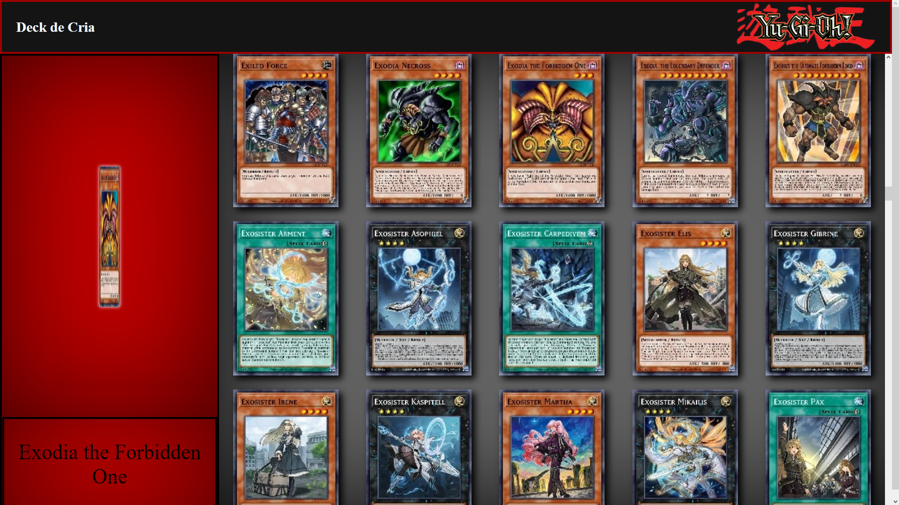

# PROJECT-YUGIOH

Projeto semelhante à pokedex, feito tambem no proposito de melhorar as habilidades de front e back-end.

Projeto feito do zero com figma, html5, css3 e javaScript. 
Atuação da equipe: 
Front-end: <a href="https://github.com/DevSirHitsuji">DevSirHitsuji</a>; 
back-end: <a href="https://github.com/kennedfer">kennedfer</a>; 

2022 copyright &copy; <a href="https://github.com/DevSirHitsuji">DevSirHitsuji</a> and <a href="https://github.com/kennedfer">kennedfer</a>

